# Bako Safe User Guide

## Introduction

Bako Safe is the native non-custodial multisignature wallet for the Fuel Network. It enhances security by requiring
multiple approvals for transactions, reducing the risk of theft and ensuring that funds remain protected even if one key
is compromised.

Designed for both individuals and groups, Bako Safe strengthens personal asset security while preventing unilateral
control in group settings, fostering collaboration in financial and contract governance.

As a browser-based platform, Bako Safe functions effortlessly on both desktop and mobile devices, offering flexibility
and ease of use.

> [!NOTE]
> Bako Safe have received QuillAudit’s **Smart Contract Initial Audit Report** with 0 security issues. This is a major
> milestone, as it underscores our commitment to delivering a secure and reliable platform for both individual and
> institutional users of Fuel Network.
https://github.com/Quillhash/QuillAudit_Reports/blob/master/Bako Safe Sway Smart Contracts Audit Report -
> QuillAudits.pdf

In this document, we will guide you through the application and set your first vault on **Fuel Ignition Mainnet.**

> [!WARNING]
> We recommend avoiding large-value deposits until you have become fully familiar with the platform’s functionality,
> features, and limitations.

## Login Options

The login screen offers three options: Passkey, Fuel Wallet, and Fuelet.

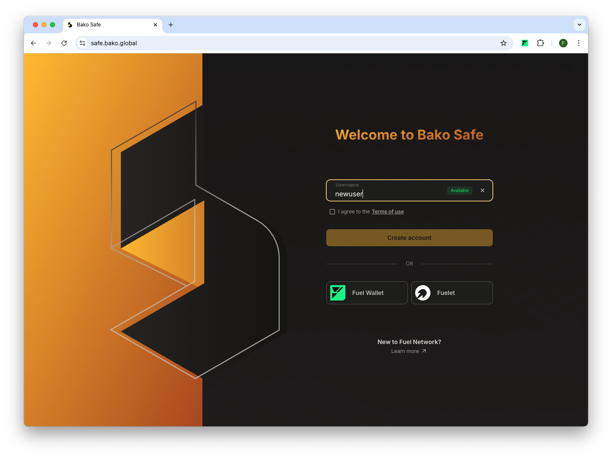

### Login With Passkey

Enter a **username** to check its availability. You will then be prompted to either create a new passkey account or log
in with an existing one. Passkey is an excellent option for accessing Bako Safe across multiple devices with the same
account.

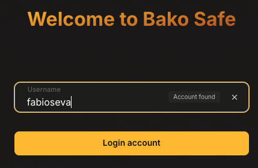

> [!NOTE]
> When using passkey, every time the name is updated in User Settings, it will also change the passkey login name.

> [!NOTE]
> **Warning: Passkey Security**
> If you lose the device where your passkey is stored, you risk losing full access to your account. To prevent this, we
> strongly recommend syncing your passkey across multiple devices or with a cloud service to ensure continued access.

### Login with Fuel Wallet/Fuelet

Ensure your [Fuel Wallet](https://wallet.fuel.network/docs/install/) or Fuelet is connected to the **Ignition Mainnet.**

If this option is not available, click on “Add new network” and set the Ignition URL to the URL that Fuel pass to your
project.

## User Interface

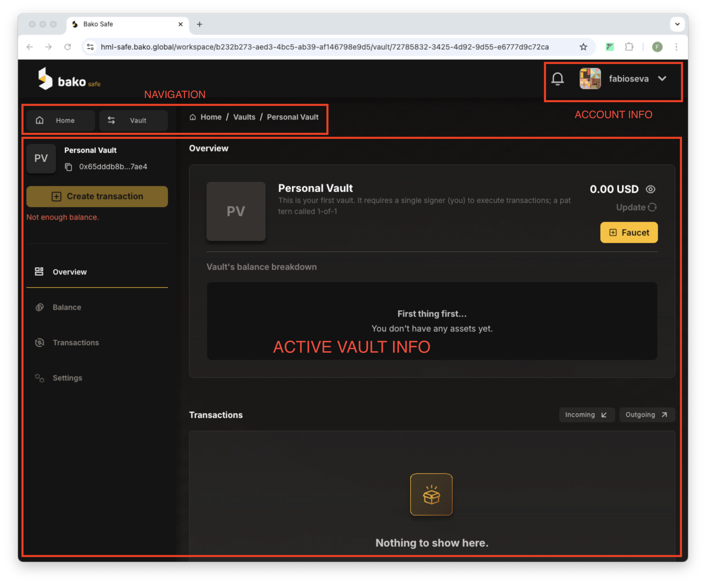

**Account Info**

Holds the address used to login to you account. It can be your Fuel Wallet, Fuelet address, or a new address attached to
your Passkey.

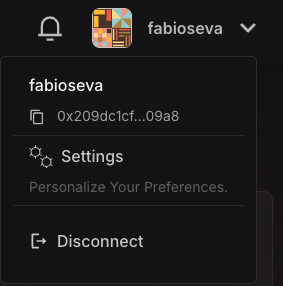

> [!NOTE]
> If using Passkey, the address shown here is the User Account address attached to the Passkey. It is different than
> your Personal Vault Address. Please, do NOT send assets to this address.

**Navigation Menu**

Use this section to seamlessly switch between vaults or gain an overview of all vaults, transactions, and your address
book in one place.

**Active Vault Menu**

View the Vault address, balance, detailed transaction history, and other settings, including the API token.

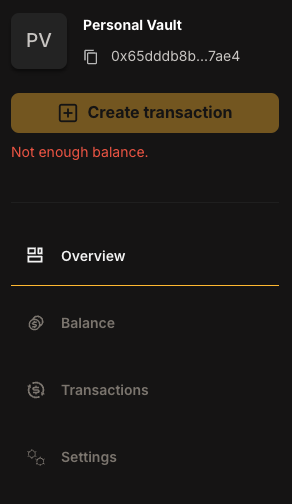

## Personal Vault

Unlike most multisig wallets, Bako Safe provides you with a Personal Vault from your very first login. This 1-1
pattern (one signer and one minimum required signer) is not meant to replace a multisig but functions as a Smart Wallet,
making it particularly useful for daily operations when using a passkey.

To take full advantage of the security provided by a multisig, you can create new vaults.

## **Create a New Vault**

In Bako Safe, creating vaults is completely free. There are no subsidies involved — it’s the magic of the Fuel Network.
You can create as many vaults as you like.

1. Click on `+ Create Vault`
2. Set a Vault Name and `Continue`
3. Set additional signers clicking on `+ Add More Addresses`

   

    <aside>
    💡

   **IMPORTANT**: Bako Safe vaults (incl. the Personal Vault) cannot be used as signers of other vaults.

    </aside>

4. Set the signature threshold.

   

    <aside>
    💡

   Choose wisely, as this cannot be changed further.

    </aside>

5. Click on `+ Create Vault`

## Working With Your Vault

### Getting Vault Address

You can find the vault address in the active Vault menu, located under the vault name or within the vault settings. You
can transfer assets to this address using any method on the Fuel Ignition mainnet.

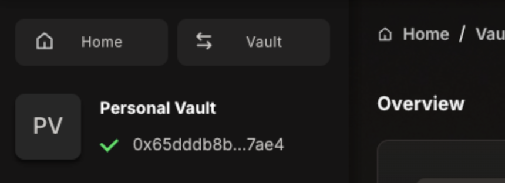

### **Adding Assets via Bridge**

Using the vault address you can add assets directly
via [Fuel Bridge.](https://app-mainnet.fuel.network/bridge?from=eth&to=fuel)

### Creating Transactions

**Transaction Details**

A simple transaction includes a name, recipient, asset and amount.

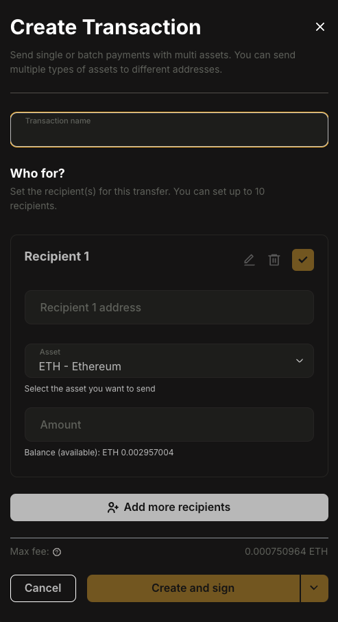

<aside>
💡

Currently, Bako Safe supports processing **only one transaction at a time** per vault. For instance, If there is a
pending transaction in the active vault, you will not be able to create a new one. We recommend using batch transactions
to streamline transfers.

</aside>

**Batch Transactions**

It is possible to send additional assets to other recipients within the same transaction. To do so, click “Add more
recipients” and follow the previous steps.

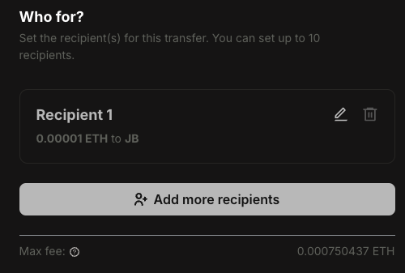

**Finishing setup**

Once completed, you have the option to either **create** the transaction for signing later or to **create and sign** it
simultaneously.

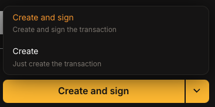

### Signing Transactions

**Transaction Details**

Pending incoming or outgoing transactions requiring your signature will automatically appear on the dashboard of the
active vault, as well as on the home dashboard (all vaults).

**Pending Completion of Signed Transactions**

Signed transactions may remain incomplete if they are still awaiting additional signers to meet the vault’s required
threshold.

### **Deploying Contracts Using CLI Gateway**

**(IN PROGRESS)**

Under the Vault menu > Settings, you can create and get an API token. Complete instructions and step-by-step for using
the gateway can be found here:

[Simplifying Smart Contract Deployment with Bako Safe](https://mirror.xyz/0x28931bEad4067cc68C3A1917D06c2f216100EdA8/V9M77wp363QC4htGp1XaLJ9jWmnR9YOWgvndLE-TBc0)

<aside>
💡

Only the vault owner (who created the vault) is able to create an API Token. If you are not seeing this option, double
check the vault owner address.

</aside>

## **Address Book**

The address book helps you manage and store frequently used addresses. It can be accessed from the Home screen or when
creating a transaction by adding a recipient.

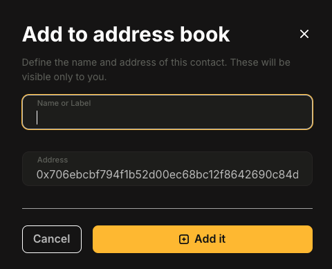

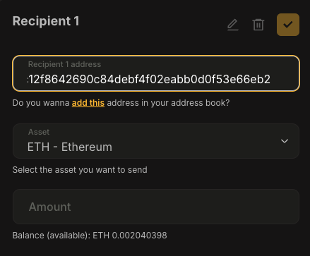

## Notifications

Stay updated! You’ll receive notifications for pending transactions, vault activity, and important platform updates.
Ensure your settings are configured to never miss an alert.

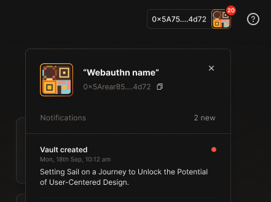

## Upcoming to Our Roadmap

- **Vault Editing**
- **User Account Recovery**
- **Parallel Pending Transactions**
- **Global On/Off Ramp Integration**
- **Dapp Discovery Hub**

## Other Resources

### **Bako Safe**

https://www.bako.global/

- [**Bako Safe SDK**](https://doc-safe.bako.global/sdk/quick-start):the heart of Bako Safe offers a robust suite of
  functionalities for vault management, transaction processes, and modern secure authentication options, incorporating
  essential wallet operations with ease.
- [**Bako Wallet Connector**](https://doc-safe.bako.global/connector/quick-start/installation): this package provides a
  seamless bridge for integrating our shared wallet functionalities into external applications, enhancing user
  experience and operational efficiency.

### **Bako ID - Extending Bako Ecosystem Functionality**

Our upcoming identity system bringing your digital legacy from social media profiles across the multiverse of Rollups
and chains.

https://www.bako.id/

- [**Bako ID Documentation**](https://docs.bako.id/)

### **Getting in Touch With The Bako Team**

As an evolving solution, we would love to hear your feedback:

[X (Twitter)](https://twitter.com/bakosafe)

[Discord](https://discord.gg/ZT4Sh2QDfq)

[Telegram](https://t.me/+lx2AxDkGc0sxZWYx)

[Github](https://github.com/Bako-Labs)
